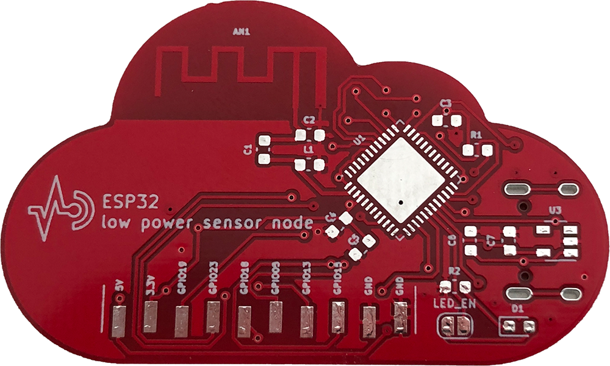
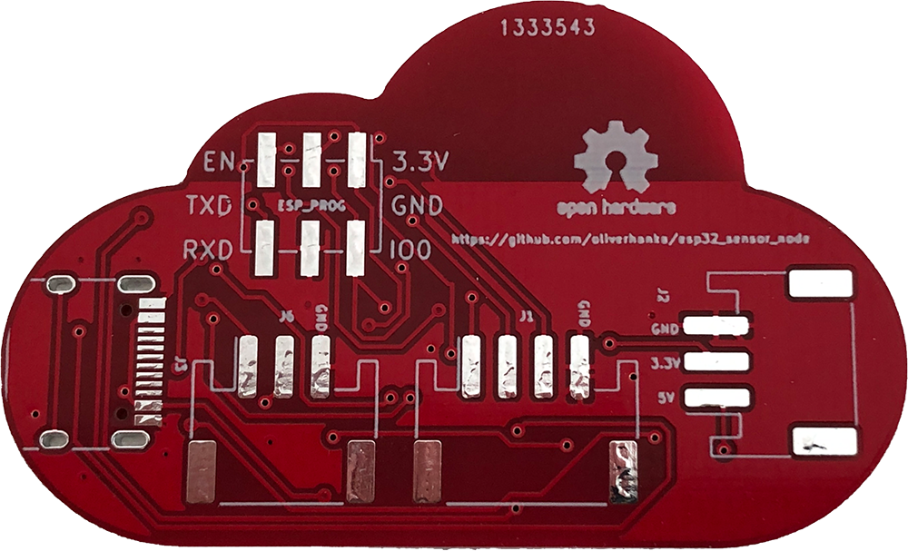
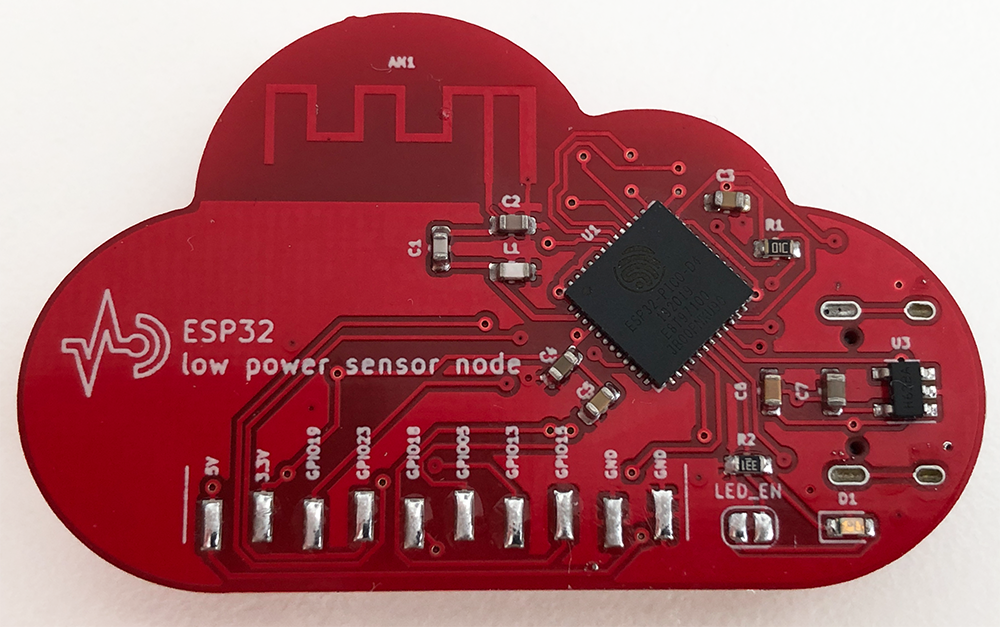
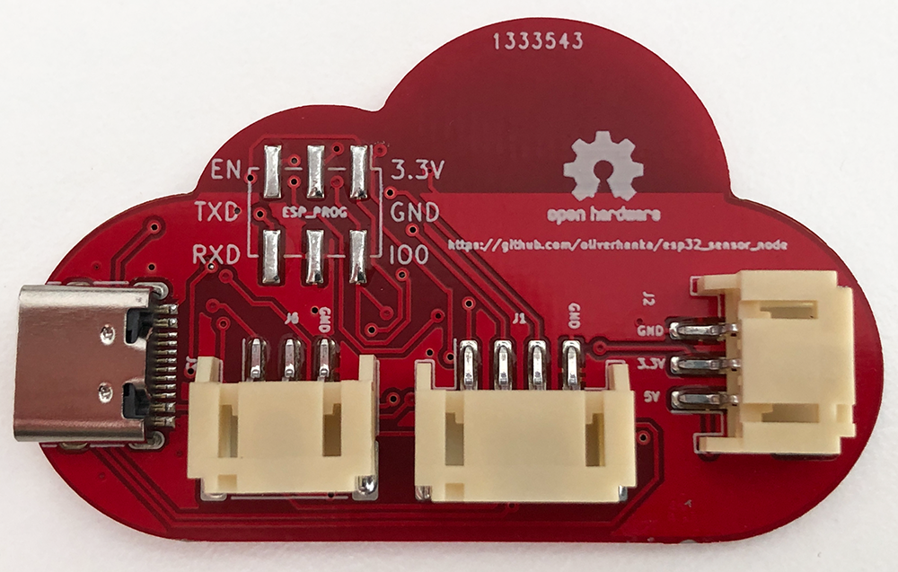

# ESP32 low power sensor node

This is a simplistic ESP32 based sensor node with a focus on very low power consumption while beeing idle. This means, external components are keept to a minimum and the selected LDO has a very low power consumption.

## Connectors / headers

| Connector | Purpose |
| -------- | -------- |
| J1     | I2C, power via GPIO14     |
| J2     | power connector, JST-PH     |
| J3     | power connector, USB-C     |
| J4     | programming interface, compatible with [ESP-Prog](https://github.com/espressif/esp-iot-solution/blob/master/documents/evaluation_boards/ESP-Prog_guide_en.md)     |
| J5     | various GPIOs or ADC and SPI, VCC, GND     |
| J6     | GPIO (e.g., for WS2812, power via GPIO2)     |

## Build

### Manufactured PCB 
 | 
------------ | -------------
frontside rev 1.0 | backside rev 1.0

### Assembled PCB

 | 
------------ | -------------
assembled front rev 1.0 | assembled back rev 1.0

### Bill of materials (BOM)

| Designator | Manufacturer Part Number | Qty |
| -------- | -------- |	-------- |	
|J6, J2 |	S3B-PH-SM4-TB(LF)(SN) |	2 |
|J1 |	S4B-PH-SM4-TB(LF)(SN) |	1 |
|J3 |	TYPE-C-31-M-12 |	1 |
|R1 |	10kΩ (0603) |	1 |
|R2 |	330Ω (0603) |	1 |
|D1 |	LED (0603) |	1 |
|L1 |	1.6nH (0603) |	1 |
|C7 |	22uF (0603) |	1 |
|C6 |	0.1uf (0603) |	1 |
|C5, C3 |	0.1uF/25V (0603) |	2 |
|C4 |	10uF/6.3V (0603) |	1 |
|C2 |	2.7pF (0603) |	1 |
|C1 |	4.7pF (0603) |	1 |
|U1 |	ESP32-PICO-D4 |	1 |
|U3 |	XC6220B331MR-G |	1 |
